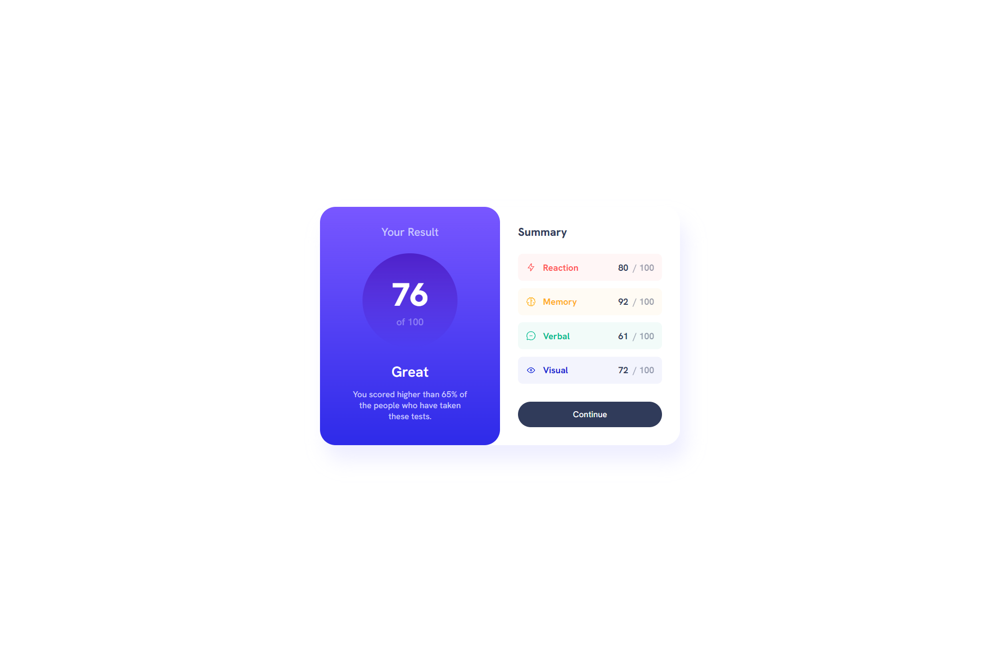
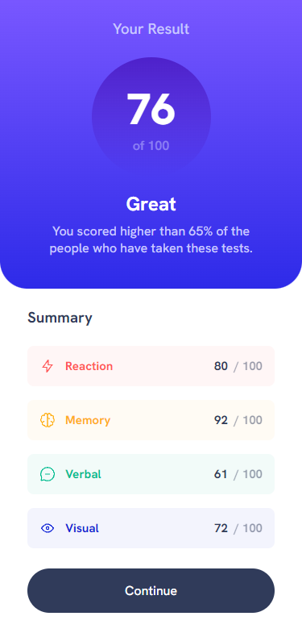

# Welcome! 👋

Thanks for checking out this front-end coding challenge.

This is a solution to the [Results summary component challenge on Frontend Mentor](https://www.frontendmentor.io/challenges/results-summary-component-CE_K6s0maV).

## Table of contents

-  [Overview](#overview)
   -  [The challenge](#the-challenge)
   -  [Screenshot](#screenshot)
   -  [Links](#links)
-  [My process](#my-process)
   -  [Built with](#built-with)
-  [Author](#author)

## Overview

### The challenge

The challenge was to build out this results summary component and get it looking as close to the design as possible (without using figma).

Users should be able to:

-  View the optimal layout for the interface depending on their device's screen size
-  See hover and focus states for all interactive elements on the page

### Screenshot

### Links

-  Solution URL: [https://github.com/nkshey/results-summary-component](https://github.com/nkshey/results-summary-component)
-  Live Site URL: [https://nkshey.github.io/results-summary-component/](https://nkshey.github.io/results-summary-component/)

## My process

### Built with

-  Semantic HTML5 markup
-  CSS custom properties
-  Flexbox
-  Mobile-first workflow

## Author

-  LinkedIn - [Nika Peikrishvili](https://www.linkedin.com/in/nikapeikrishvili/)
-  Frontend Mentor - [@nkshey](https://www.frontendmentor.io/profile/nkshey)
